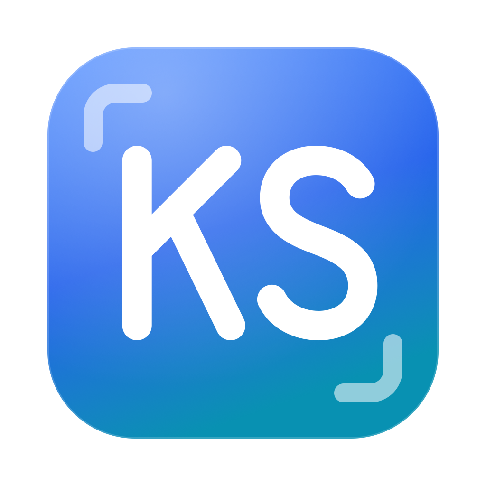

<p align="center">
  
</p>

<h1 align="center">KlikSnap</h1>

<p align="center">
  A free, open-source screenshot tool for macOS and Windows. Small and fast, with no account and no cloud upload.
</p>

<p align="center">
  <a href="https://github.com/ashafizullah/kliksnap/actions/workflows/ci.yml"></a>
  <a href="https://github.com/ashafizullah/kliksnap/releases/latest"></a>
  <a href="https://github.com/ashafizullah/kliksnap/releases"></a>
  <a href="LICENSE"></a>
  <br>
  
  
  
  
</p>

<p align="center">
  <a href="https://trakteer.id/adamshafizullah/tip"></a>
</p>

## Features

- **Capture** an area, a window, or the whole screen from a global shortcut or the menu bar / tray icon
- **Floating preview** after each capture: copy, save, or open the editor
- **Annotate**: arrow, line, rectangle, ellipse, text, highlighter, pixelate (blur), crop, undo/redo
- **Copy text (OCR)** from anything on screen, using the OCR engine built into the OS (Apple Vision / Windows.Media.Ocr). If the selection holds a QR code, its content is copied instead
- Copies to the clipboard automatically; optional auto-save to a folder
- **Auto-update** from GitHub Releases (signed packages; checked daily, or via tray → *Check for Updates…*)

The macOS app is about 4 MB per architecture (a 5 MB universal DMG) and uses about 15 MB of memory while idle.

## Download

Get the latest version from **[Releases](https://github.com/ashafizullah/kliksnap/releases/latest)**:

| Platform | File |
|---|---|
| macOS 12.3+ (Apple Silicon & Intel) | `KlikSnap_x.y.z_universal.dmg` |
| Windows 10/11 (x64) | `KlikSnap_x.y.z_x64-setup.exe` or `.msi` |

**macOS:** the app isn't notarized yet. On first launch, right-click KlikSnap → **Open**, or run `xattr -cr /Applications/KlikSnap.app`. Then allow **Screen Recording** when asked (System Settings → Privacy & Security → Screen Recording).

**Windows:** SmartScreen may warn about an unsigned app. Click **More info → Run anyway**.

## Default shortcuts

| Action | Shortcut |
|---|---|
| Capture area | `⌥⇧4` / `Alt+Shift+4` |
| Capture window | `⌥⇧5` / `Alt+Shift+5` |
| Capture screen | `⌥⇧3` / `Alt+Shift+3` |
| Copy text (OCR) | `⌥⇧2` / `Alt+Shift+2` |

In area mode, press `Space` to switch to window mode and `Esc` to cancel. In the editor, use `A L R O T H P C` to pick a tool, `1 2 3` to set the size, `⌘C` to copy, `⌘S` to save and `⌘⇧S` for Save As.

## Development

Requires Node 22+ and stable Rust.

```sh
npm install
npm run tauri dev      # run
npm run tauri build    # bundle (.app/.dmg on macOS, .msi/.exe on Windows)
```

CI runs type checks, `cargo fmt`, `clippy` and tests on macOS and Windows for every push and pull request. Pushing a `v*` tag builds the universal macOS DMG and the Windows installers, signs the update packages and attaches everything (including `latest.json` for the in-app updater) to a draft GitHub release. Publish the draft to roll it out: installed apps only see published releases.

Releases need the `TAURI_SIGNING_PRIVATE_KEY` repository secret. The matching public key is in `tauri.conf.json`. Bump `version` in `tauri.conf.json`, `Cargo.toml` and `package.json` before tagging.

```sh
git tag v0.1.0 && git push origin v0.1.0
```

### How it stays light

- Tauri 2 uses the system webview (WKWebView / WebView2), so no Chromium is bundled
- Svelte 5 compiles away; the whole UI is ~75 KB of JS/CSS
- Windows are created on demand and destroyed when closed; idle KlikSnap is only a tray icon
- Captures go to the webview through a custom `ks://` protocol as uncompressed BMP, so nothing is base64-encoded through JSON
- OCR uses the OS engine instead of bundling Tesseract

### Layout

```
src-tauri/src/
  lib.rs        app state, capture flow, ks:// protocol
  capture.rs    screen/window capture (xcap), cropping
  ocr.rs        Apple Vision / Windows.Media.Ocr, QR codes
  ui.rs         window creation and placement
  commands.rs   commands called from the webviews
  output.rs     clipboard, PNG saving
  platform.rs   macOS/Windows specifics (cursor, permissions, window level)
  hotkeys.rs, tray.rs, settings.rs
src/
  Overlay.svelte   area/window selection
  Preview.svelte   floating preview
  Editor.svelte    annotation editor (lib/editor/*)
  Settings.svelte, Toast.svelte
```

## Support

KlikSnap is free and always will be. If it saves you time, **[buy me an AI token on Trakteer](https://trakteer.id/adamshafizullah/tip)** ☕🤖. It keeps this project being developed.

<p align="center">
  <a href="https://trakteer.id/adamshafizullah/tip"></a>
  <br>
  <sub>Scan to support on Trakteer</sub>
</p>

## Contributing

Issues and pull requests are welcome. `main` is protected: every change goes through a pull request and must pass CI (type checks, `cargo fmt`, `clippy` and tests on macOS and Windows). Please run `npm run check` and `cargo clippy` locally before opening a PR.

## License

[MIT](LICENSE)
